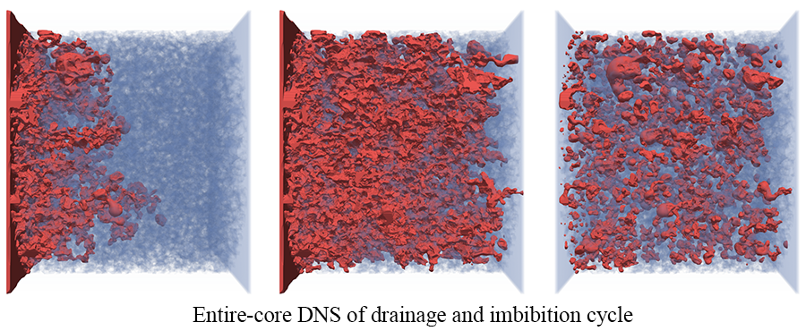

<!--
*** Thanks for checking out the Best-README-Template. If you have a suggestion
*** that would make this better, please fork the repo and create a pull request
*** or simply open an issue with the tag "enhancement".
*** Thanks again! Now go create something AMAZING! :D
-->

# MF-LBM: A Portable, Scalable and High-performance Lattice Boltzmann Code for DNS of Flow in Porous Media




<br/>
<br/>

<!-- TABLE OF CONTENTS -->

<details open="open">
  <summary>Table of Contents</summary>
  <ol>
    <li><a href="#about-the-code">About The Code</a></li>     
        <ul>
          <li><a href="#features">Features</a></li>
        </ul>
        <ul>
          <li><a href="#components">Components</a></li>
        </ul>
        <ul>
          <li><a href="#technical-details-of-the-main-simulation-code">Technical details of the main simulation code</a></li>
        </ul>
        <ul>
          <li><a href="#citing-mf-lbm">Citing MF-LBM</a></li>
        </ul>
    <li><a href="#build-instructions">Build Instructions</a></li>
        <ul>
          <li><a href="#prerequisites">Prerequisites</a></li>
        </ul>
        <ul>
          <li><a href="#installation">Installation</a></li>
        </ul>
    <li><a href="#usage">Usage</a></li>
        <ul>
          <li><a href="#pre-processing-code">Pre-processing code</a></li>    <!-- #name must be identical to the bullet name (including dash) except capital letter and space (replaced by dash) -->
        </ul>
        <ul>
          <li><a href="#the-main-simulation-code">The main simulation code</a></li>
        </ul>
        <ul>
          <li><a href="#output-files">Output files</a></li>
        </ul>
    <li><a href="#important-notes">Important Notes</a></li> 
    <li><a href="#license">License</a></li>
    <li><a href="#contact">Contact</a></li>
  </ol>
</details>

<br/>
<!-- ABOUT THE CODE -->

## About The Code

MF-LBM [1] [2] is a high-performance lattice Boltzmann (LB) code for direct numerical simulation (DNS) of flow in porous media, primarily developed by Dr. Yu Chen (LANL), under the supervision of Prof. Albert Valocchi (UIUC), Dr. Qinjun Kang (LANL) and Dr. Hari Viswananthan (LANL). 'MF' refers to microfluidics or 'Magic Find'. The code was first developed at University of Illinois at Urbana-Champaign based on a mainstream LB color-gradient multiphase model and further improved at Los Alamos National Laboratory by implementing the Continuum-Surface-Force and geometrical wetting models to reduce spurious currents so that the inertial effects in scCO<sub>2</sub> and brine displacement in porous media can be accounted for [2]. 

### Features
* exploring multiple levels of parallelism
* extensively optimized for vectorization
* directive-based parallel programing model supporting CPU, GPU, MIC and ARM
* advanced LB multiphase model (CSF model + geometrical wetting model) ensuring relatively small spurious currents
* overlapped communication and computation
* sample geometry files, pre-processing and post-processing code included
  
### Components
* [`Sample geometry files`](https://github.com/lanl/MF-LBM-extFiles/tree/main/geometry_files) (in submodule):
  * [`simple_geometry_tube_sphere`](https://github.com/lanl/MF-LBM-extFiles/tree/main/geometry_files/tube_sphere_example): a tube with a spherical obstacle in the center  
  * [`rock_sample_text_images`](https://github.com/lanl/MF-LBM-extFiles/tree/main/geometry_files/sample_rock_geometry_textimage/bentheimer_oregon_state_240): text images from cropped Bentheimer sandstone scans [3]
  * [`rock_sample_wall_array_converted`](https://github.com/lanl/MF-LBM-extFiles/tree/main/geometry_files/sample_rock_geometry_wallarray): binary file of the wall array converted from text images
  * [`rock_sample_wall_array_processed`](https://github.com/lanl/MF-LBM-extFiles/tree/main/geometry_files/sample_rock_geometry_wallarray): binary file of the wall array converted from text images with added buffer layers 
* [`Pre-processing code`](preprocessing): 
  * [`convert_textimages_to_WallArray`](preprocessing/1.convert_textimages_to_WallArray): converting text images from rock scans to a single 3D wall array stored in binary format
  * [`create_geometry_to_WallArray`](preprocessing/1.create_geometry_to_WallArray): creating simple geometries
  * [`geometry_modification`](preprocessing/2.geometry_modification): modifying the 3D wall array, i.e., adding inlet/outlet buffer layers or cropping 
  * [`wall_boundary_preprocess`](preprocessing/3.wall_boundary_preprocess): computing normal directions of the solid surfaces
* [`Main simulation code`](multiphase_3D):
  * [`multiphase_3D`](multiphase_3D): 3D multiphase flow simulation code
  * (coming soon) 3D single phase flow simulation code 
* [`Post-processing code`](postprocessing):
  * [`distributed_phi_to_vtk_conversion`](postprocessing/exteme_large_sim_parallel_IO/distributed_phi_to_vtk_conversion): for extremely large simulation only, converting distributed phase field data to vtk file for visualization
  * [`distributed_full_flow_field_process`](postprocessing/exteme_large_sim_parallel_IO/distributed_full_flow_field_process): for extremely large simulation only, converting distributed full flow field data for further analysis
### Technical details of the main simulation code
Modern manycore processors/coprocessors, such as GPUs and Intel Xeon Phi processors, are developing rapidly and greatly boost computing power. These processors not only provide much higher FLOPS (floating-point operations per second) but also much higher memory bandwidth compared with traditional CPU. One of the most attractive features of the lattice Boltzmann method (LBM) is that it is explicit in time, has nearest neighbor communication, and the computational effort is in the collision step, which is localized at a grid node. For these reasons, the LBM is well suited for manycore processors which require a higher degree of explicit parallelism. The data movement in the LBM is much more intensive than for traditional CFD considering that the D3Q19 lattice model has 19 lattice velocities. Given the current state of computational hardware, in particular the relative speed and capacity of processors and memory, the LBM is a memory-bandwidth-bound numerical method. The high memory bandwidth provided by GPUs or Intel Xeon Phi processors greatly benefits the LBM.

The code is written on Fortran 90 and employs MPI-OpenACC/OpenMP hybrid programing model. The main reason that we chose OpenACC/OpenMP (directive-based parallel programming models) over CUDA is that we want to keep the code portable across different computing platforms so that we are not limited by the NVIDIA GPU solution. As GPU and Intel Xeon Phi processor (and even latest CPU from Intel with AVX512 instructions) rely heavily on SIMT/SIMD, the optimization strategy for these manycore processors/coprocessors are similar, which enables us to achieve reasonable performance across different platforms:
* The AA pattern streaming method is employed to significantly reduce memory access and memory consumption.
* The structure of arrays (SoA) data layout is used to achieve coalesced memory access and maximize vectorization.
* Communication and computation is overlapped to achieve good parallel efficiency, particularly for heterogenous computing platforms.

### Citing MF-LBM
Chen, Y., Valocchi, A., Kang, Q., & Viswanathan, H. S. (2019). Inertial effects during the process of supercritical CO2 displacing brine in a sandstone: Lattice Boltzmann simulations based on the continuum‐surface‐force and geometrical wetting models. Water Resources Research, 55, 11144– 11165. https://doi.org/10.1029/2019WR025746

<br/>

<!-- Build Instructions -->
## Build Instructions

### Prerequisites
* A Fortran compiler 
* A MPI implementation (most of the run scripts in this repo are based on OpenMPI)
* CUDA toolkit (for NVIDIA GPU platform)
* PGI Fortran compiler (for NVIDIA GPU platform)
* Intel Fortran compiler (for Intel Xeon Phi)
* Make

### Installation

1. Clone the repo
   ```sh
   git clone https://github.com/lanl/MF-LBM.git
   ```
2. Initiate submodules for external non-code files (geometry files used in the test suites)
   ```sh
   cd path-to-MF-LBM/MF-LBM-extFiles
   git submodule init
   git submodule update
   ``` 
3. Make
   ```sh
   cd path-to-MF-LBM/multiphase_3D
   ```
   1. CPU version
        ```sh
        # Make necessary changes to makefile:
        # Choose CPU as the architecture option.
        # Choose proper compiler.
        # Enabling OpenMP is recommended.
        # See instructions in makefile for more information.  
        your-preferred-editor makefile
        make
        # MF_LBM.cpu will be generated
        ```
    1. GPU version
        ```sh
        # Make necessary changes to makefile:
        # Choose GPU as the architecture option.
        # Choose PGI compiler.
        # OpenMP must be disabled.
        # See instruction in makefile for more information.  
        your-preferred-editor makefile
        # Make sure to enable OpenACC in preprocessor.  
        your-preferred-editor 0.src/preprocessor.h  
        make
        # MF_LBM.gpu will be generated
        ```
    2. MIC (Intel Xeon Phi) version
        ```sh
        # Make necessary changes to makefile:
        # Choose MIC as the architecture option.
        # Choose proper compiler.
        # OpenMP and AVX512 must be enabled for MIC version.
        # See instructions in makefile for more information.    
        your-preferred-editor makefile     
        make
        # MF_LBM.mic will be generated
        ```
4. Configure run scripts (for CPU platform)
      ```sh
      cd working_directory
      cp path-to-MF-LBM/multiphase_3D/run_template/template-config.sh ./config.sh
      # Make necessary changes to config.sh (i.e., input parameters, paths and run command). 
      # See instruction in template-config.sh for more information.
      your-preferred-editor config.sh
      ./config.sh
      # A script, irun.sh, will be generated. 
      
      # If OpenMP is enabled (recommended for CPU, MIC, and ARM platform), then run the following command:
      # export OMP_NUM_THREADS=n
      # , where n is recommended to be the core count of the UMA domain of the CPU.

      # At least one MPI rank per UMA domain is recommended.

      # For GPU platform, MPI process number should be the total number of GPUs: one MPI rank per GPU.
      ```
5. Run the program
   ```sh
   # See instruction in template-config.sh and irun.sh for more information.
   ./irun.sh new
   ```
<br/>


<!-- USAGE EXAMPLES -->
## Usage
### Pre-processing code

* [`convert text images to wall array`](preprocessing/1.convert_textimages_to_WallArray)
   ```sh
   cd path-to-MF-LBM/preprocessing/1.convert_textimages_to_WallArray
   ./compile.sh
   ./a.out
   ```
  This example converts [rock_sample_text_images](MF-LBM-extFiles/geometry_files/sample_rock_geometry_textimage/bentheimer_oregon_state_240) to single wall array stored in binary format. No cropping and modification of the rock geometry are made. Loading binary wall array is much faster than large number of text images. This shall be the first step to read in text images before further modification.

* [`create geometry`](preprocessing/1.create_geometry_to_WallArray)
  ```sh
  cd path-to-MF-LBM/preprocessing/1.create_geometry_to_WallArray
  ./compile.sh
  ./a.out
  ```
  This example creates a tube with a spherical obstacle in the center and stored the corresponding wall array in binary format. One can modify the code to create different geometries.
   
* [`geometry modification`](preprocessing/2.geometry_modification)
  ```sh
  cd path-to-MF-LBM/preprocessing/2.geometry_modification
  ./compile.sh
  ./a.out
  ```
  This example reads in a wall array file [rock_sample_wall_array_converted](https://github.com/lanl/MF-LBM-extFiles/tree/main/geometry_files/sample_rock_geometry_wallarray) which is converted from [rock_sample_text_images](https://github.com/lanl/MF-LBM-extFiles/tree/main/geometry_files/sample_rock_geometry_textimage/bentheimer_oregon_state_240), and add buffer layers at the inlet and outlet so that proper boundary conditions can be applied. This code can also be used to crop large samples.

* [`wall boundary pre-processing`](preprocessing/3.wall_boundary_preprocess)
  ```sh
  cd path-to-MF-LBM/preprocessing/3.wall_boundary_preprocess
  ./compile.sh
  ./a.out
  ```
  This example reads in the processed wall array file [rock_sample_wall_array_processed](https://github.com/lanl/MF-LBM-extFiles/tree/main/geometry_files/sample_rock_geometry_wallarray), computes the normal directions of all solid boundary nodes and stores the boundary information in binary format that can be used in the main flow simulation code. Read  [compile.sh](preprocessing/3.wall_boundary_preprocess/compile.sh) for compiler information (extremely important) for this example. The same boundary info calculation can be completed in the main flow simulation code ([Geometry_preprocessing.F90](multiphase_3D/0.src/Boundary_multiphase_outlet.F90)). However, it is recommended to perform the boundary info calculation before the main simulation and load the boundary info from external file to the main simulation, when the rock sample is relatively large.

### The main simulation code
Check out [template-simulation_control.txt](multiphase_3D/run_template/template-config.sh) for more information regarding simulation control. The units used in the simulation control file are all lattice unit. One can control capillary number, contact angle, absolute values of surface tension and viscosities to link the simulation with physical system. In particular, the absolute values of surface tension and viscosities will affect Reynolds number even when the capillary number is fixed. The Ohnesorge number is recommended to control the parameters when inertial effects are not negligible [2].

* [`Contact angle measurement`](test_suites/3D_simulation/1.drop_attached_wall)
   ```sh
   cd working_directory
   cp path-to-MF-LBM/test_suites/3D_simulation/1.drop_attached_wall/config.sh ./
   # edit config.sh (path and run command based on your system; path does not need to be changed if using the default folder)
   your-preferred-editor config.sh
   ./config.sh    
   ./irun.sh new
   ```
   This example is used to measure contact angle, where a nonwetting drop (fluid1 drop) is attached to a flat wall (y=1 plane)

* [`Drainage in a square duct`](test_suites/3D_simulation/2.drainage)
   ```sh
   cd working_directory
   cp path-to-MF-LBM/test_suites/3D_simulation/2.drainage/config.sh ./
   # edit config.sh (path and run command based on your system; path does not need to be changed if using the default folder)
   your-preferred-editor config.sh
   ./config.sh    
   ./irun.sh new
   ```
   This example simulates nonwetting fluid1 displacing wetting fluid2 in a square duct until one pore-volume fluid1 is injected.

* [`Drainage in a tube with a spherical obstacle`](test_suites/3D_simulation/3.drainage_hardcode_geometry)
   ```sh
   # The geometry is created inside the main flow simulation code for convenience (Misc.F90/modify_geometry subroutine). Not the recommended way to run the program. 
   cd working_directory
   cp path-to-MF-LBM/3d-multiphase/test_suites/3D_simulation/3.drainage_external_geometry/config.sh ./
   # edit config.sh (path and run command based on your system; path does not need to be changed if using the default folder)
   your-preferred-editor config.sh
   ./config.sh    
   ./irun.sh new
   ```
   This example simulates nonwetting fluid1 displacing wetting fluid2 in a tube with a spherical obstacle in the center. The tube and spherical obstacle are created inside the simulation code. Simulation stops when the nonwetting fluid reaches outlet.

* [`Imbibition in a real rock sample using external rock geometry file`](test_suites/3D_simulation/4.imbibition_external_geometry)
   ```sh
   # The geometry file is created from pre-processing code example (MF-LBM-extFiles/geometry_files/sample_rock_geometry_wallarray/bentheimer_in10_240_240_240_out10.dat)
   cd working_directory
   cp path-to-MF-LBM/test_suites/3D_simulation/3.drainage_external_geometry/config.sh ./
   # edit config.sh (path and run command based on your system; path does not need to be changed if using the default folder)
   your-preferred-editor config.sh
   ./config.sh    
   ./irun.sh new
   ```
   This example simulates wetting fluid2 displacing nonwetting fluid1 in a real rock sample using external rock geometry file. Simulation stops one pore-volume fluid2 is injcted.

* [`Steady state relative permeability measurement`](test_suites/3D_simulation/5.fractional_flow_external_geometry_preprocessed)
   ```sh
  # The geometry file is created from pre-processing code example (MF-LBM-extFiles/geometry_files/sample_rock_geometry_wallarray/bentheimer_in10_240_240_240_out10.dat). The boundary info file need to be created use the wall_boundary_preprocess code (preprocessing/3.wall_boundary_preprocess)
   cd path-to-MF-LBM/preprocessing/3.wall_boundary_preprocess
   ./compile.sh
   ./a.out

   cd working_directory
   cp path-to-MF-LBM/3d-multiphase/test_suites/3D_simulation/3.drainage_external_geometry/config.sh ./
   # edit config.sh (path and run command based on your system; path does not need to be changed if using the default folder)
  # specify the geometry file and solid-boundary-info file paths on config.sh
   your-preferred-editor config.sh
   ./config_sim.sh    
   ./irun.sh new
   ```
   This example simulates body force driven fractional flow for steady state relative permeability measurement, using external rock geometry file and corresponding pre-computed boundary info file. 

### Output files
Three output directories will be generated:
* out1.output: bulk properties (i.e., saturation, flow rate) against time. See [Monitor.F90](multiphase_3D/0.src/Monitor.F90) for more information.
* out1.checkpoint: checkpoint data used to restart simulation. See [IO_multiphase.F90](multiphase_3D/0.src/IO_multiphase.F90) for more information.
* out1.field_data: legacy vtk files for flow analysis. See [IO_multiphase.F90](multiphase_3D/0.src/IO_multiphase.F90) for more information. For extremely large simulation (extreme_large_sim_cmd=1 in [template-simulation_control.txt](multiphase_3D/run_template/template-simulation_control.txt)), distributed flow field data will be stored for performance consideration. [Post-processing code](postprocessing/exteme_large_sim_parallel_IO) is provided to process those distributed data.

<br/>

## Important Notes
* Contact angle
  
  The contact angle in the control file must be less or equal to 90 degrees due to the particular numerical scheme used, meaning that fluid1 and fluid2 will always be the nonwetting phase and wetting phase, respectively. [Drainage](test_suites/3D_simulation/2.drainage) and [imbibition](test_suites/3D_simulation/4.imbibition_external_geometry) can be completed by injecting fluid1 and fluid2 respectively.

* Run command
  
  Several sample run commands are listed in [template-config.sh](multiphase_3D/run_template/template-config.sh). This code employs MPI-OpenMP hybrid programing model for the non-GPU version, where memory affinity on NUMA architectures is very important to achieve expected performance. One should avoid using OpenMP on NUMA domains by using one or more MPI ranks per UMA domain and setting appropriate socket/NUMA affinity in OpenMPI (or other MPI implementations). Number of threads in OpenMP should not exceed the core count or thread count (if multithreading is enabled) of corresponding UMA. 

* Domain decomposition

  Domain decomposition along X direction is no longer supported in the main simulation code for the moment, due to the consideration of non-vectorized data packing and halo area computation. Domain decompositions along Y and Z direction are usually sufficient as single MPI rank corresponds to tens of CPU cores or a full GPU.


* GCC10 compiler issue
  
  Building the code with GCC10 may show error messages like 
  >Type mismatch between actual argument at (1) and actual argument at (2)

  This is a known issue with GCC10. Use GCC10 new option *-fallow-argument-mismatch* to turn these errors to warnings for the moment.

<br/>

<!-- LICENSE -->
## License
Distributed under the BSD-3 License. See [LICENSE] for more information.

© 2021. Triad National Security, LLC. All rights reserved.

This program was produced under U.S. Government contract 89233218CNA000001 for Los Alamos National Laboratory (LANL), which is operated by Triad National Security, LLC for the U.S. Department of Energy/National Nuclear Security Administration. All rights in the program are reserved by Triad National Security, LLC, and the U.S. Department of Energy/National Nuclear Security Administration. The Government is granted for itself and others acting on its behalf a nonexclusive, paid-up, irrevocable worldwide license in this material to reproduce, prepare derivative works, distribute copies to the public, perform publicly and display publicly, and to permit others to do so.

<br/>

<!-- CONTACT -->
## Contact

Dr. Yu Chen - yu_chen_007@outlook.com

Dr. Qinjun Kang - qkang@lanl.gov

<br/>


<!-- MARKDOWN LINKS & IMAGES -->

[LICENSE]: https://github.com/ychen-hpc/mf-lbm-dev/blob/master/LICENSE
[1]: https://www.sciencedirect.com/science/article/abs/pii/S0169772217300645
[2]: https://agupubs.onlinelibrary.wiley.com/doi/abs/10.1029/2019WR025746
[3]: https://agupubs.onlinelibrary.wiley.com/doi/full/10.1002/2016GL070304


